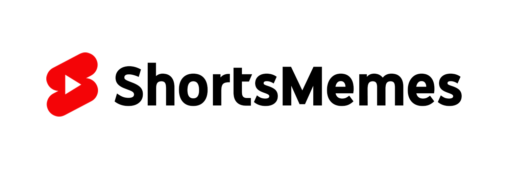

<div align="center">
  Memes-to-Shorts Compiler - Automated Python Script
</div>

# ShortsMemes
Ever seen those short memes videos while scrolling thru **YouTube Shorts**? 
They collect a lot of views and subscribers, and could even be monetized.
This program lets u upload these short videos automatically by simpely editing the config. 
I proudly introduce ShortsMemes.

# Installation & Setup
1. Clone this repository: ```git clone https://github.com/nak0823/ShortsMemes.git```
2. Install the required packages: ```pip install -r requirements.txt```
3. Run the script: ```python main.py```
4. Configure [Settings.toml](https://github.com/nak0823/ShortsMemes/blob/main/Settings.toml) inside the cloned repository.
    - To prevent any errors make sure to configure **everything**!
    - Get your Imgur Authorization [here](https://imgur.com/account/settings/apps)
    - Get your Reddit Id & Secret [here](https://www.reddit.com/prefs/apps)
    - To get the YouTube **API** working follow the following steps:
      - Create a new project [here](https://console.cloud.google.com/)
      - Install the required API [YouTube Data API V3](https://console.cloud.google.com/marketplace/product/google/youtube.googleapis.com?q=search&referrer=search&project=youtube-x-python-392919)
      - Go to [Credentials](https://console.cloud.google.com/apis/credentials) and click "+ New Credentials".
5. Finished Installing and Setting up.

# Shorts Example
https://github.com/nak0823/ShortsMemes/assets/130221150/66a5492b-ecac-4a96-a5b7-4511bb67d0b1

# My Results

(Note: I didn't upload daily!)

# Contribute
- When facing any issue dont hestitate to open an [issue](https://github.com/nak0823/ShortsMemes/issues)
- Open a PR if you want to add something.
- Star & fork the repository.

# Developers
- [Serialized](https://github.com/nak0823)


